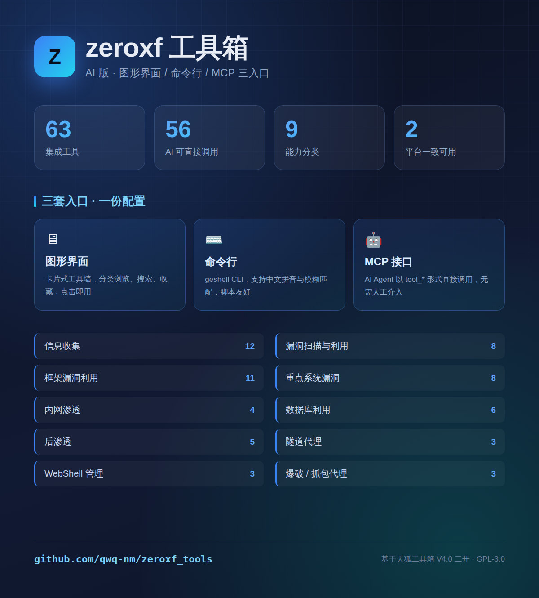
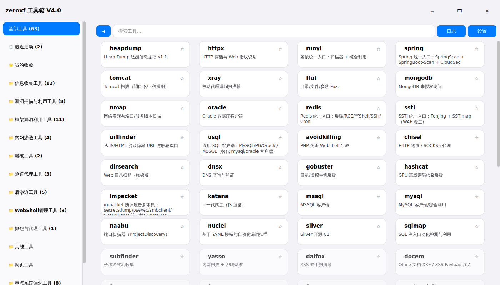
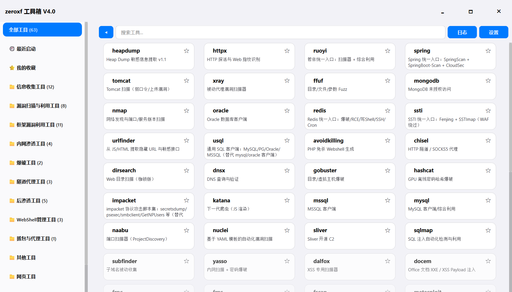

# zeroxf 工具箱 · AI 版

**一个既给人用、也给 AI 用的渗透测试工具箱**——63 个工具，统一的图形界面、命令行与 MCP 接口，三套入口共用同一份工具注册表。

[](#安装)
[-brightgreen)](#集成的工具)
[](LICENSE)
[](#mcp-ai-调用)



### 界面预览

两端界面完全一致（同一份代码 + 同一份工具注册表）：

| WSL / Linux | Windows |
| --- | --- |
|  |  |

---

## 这是什么

以 **天狐工具箱 V4.0**（[`wr0ld/tianhu-toolbox-v4`](https://github.com/wr0ld/tianhu-toolbox-v4)）为框架底座做的二开，在原版的图形界面之外，补上了 **命令行（geshell）** 与 **MCP** 两套程序化入口，让同一批工具既能人工点击操作，也能被脚本和 AI 直接调用。

架构与接口设计参考了枷锁工具箱（GetShell）的 `ai/launch.py`。

| 入口 | 文件 | 面向 |
| --- | --- | --- |
| 🖥 **图形界面** | `main.py` / `launcher.py` | 人工操作，卡片式工具墙 |
| ⌨️ **命令行** | `geshell` / `geshell.cmd` | 脚本、批处理、终端快手 |
| 🤖 **MCP** | `ai/mcp_server.py` | AI Agent 以工具形式调用 |

**单一数据源**：三者共用 `config/tools.json`。新增一个工具、改一次路径，三个入口同时生效。

---

## 亮点

- **63 个工具开箱可用**，横跨信息收集到后渗透的完整链路；其中 **56 个可被 AI 直接调用**
- **三套入口，一份配置** —— GUI 里能点的，CLI 和 MCP 里都能调，不会出现"界面有、命令行没有"的割裂
- **依赖自动装配** —— `provision_tools.py` 一条命令拉齐全部工具二进制、便携 JDK、GUI 运行时，自动适配 Windows / Linux / macOS
- **零环境依赖的 JDK 方案** —— 内置便携 JDK 8/11/17（8 与 11 为 Liberica full 版，内含 JavaFX），12 个 jar 类工具无需系统装 Java
- **跨平台一致** —— 同一套脚本在 WSL 与 Windows 原生均可用，按平台自动选择资产（`.exe` / ELF）
- **URL 都能救回来** —— 对已停止公开分发的工具（如 xray）也留有可用来源；对无源工具提供功能等价替代
- **容错安装** —— 单个工具失败不会中断整批，最后统一汇报
- **AI 友好** —— 工具元数据带 `risk` / `ai_callable` / `example` 字段，AI 能自行判断哪些该调、怎么调

---

## 集成的工具

**共 63 个**（56 个 AI 可直接调用），按 9 大类组织：

| 分类 | 数量 | 代表工具 |
| --- | ---: | --- |
| 信息收集 | 12 | `nmap` `httpx` `nuclei` `ffuf` `subfinder` `naabu` `katana` `dnsx` `uncover` `gobuster` `urlfinder` `dirsearch` |
| 漏洞扫描与利用 | 8 | `nuclei` `sqlmap` `xray` `dalfox` `zap` `exploitdb` `ssti` `docem` |
| 框架漏洞利用 | 11 | `shiro` `struts2` `weblogic` `fastjson`→`jndi` `log4j`→`jndi` `thinkphp` `spring` `tomcat` `dedecmscan` `redis` `nacos` |
| 重点系统漏洞 | 8 | `heapdump` `ruoyi` `nacos` `jenkins` `xxl-job` `jeecg` `iwannagetall` `hyacinth` |
| 内网渗透 | 4 | `fscan` `yasso` `netexec` `impacket` |
| 爆破 | 2 | `hydra` `hashcat` |
| 隧道代理 | 3 | `frps` `frpc` `chisel` |
| 后渗透 | 5 | `metasploit` `sliver` `cobaltstrike` `avoidkilling` `revshell` |
| 数据库利用 | 6 | `mysql` `mssql` `mongodb` `oracle` `usql` `dbcombo` |
| WebShell 管理 | 3 | `蚁剑` `godzilla` `behinder` |
| 抓包与代理 | 1 | `BurpSuite` |

**能力覆盖**：被动信息收集 → 主动漏洞扫描 → 框架专项利用 → 内网横向 → 权限维持 → 数据提取，一条完整链路。

> 完整清单与调用方式见 [`ai/tools.md`](ai/tools.md)（`geshell gendocs` 自动生成）。

### 关于不可得的工具

以下工具因授权、分发或来源原因无法自动获取，工具箱提供了**功能等价的替代**或说明：

| 工具 | 情况 | 处理 |
| --- | --- | --- |
| `fastjson` `log4j` | 专用利用 jar 无公开源 | 由 **JNDI-Injection-Exploit**（`jndi`）统一覆盖两者场景 |
| `CobaltStrike` `BurpSuite` `蚁剑` | 商业软件 / 需自备 | 保留条目，装入后即可用；`Sliver`（`sliver` 命令）与 `ZAP` 分别是 CS / Burp 的开源等价物 |

`geshell doctor` 会明确列出这些项，不会静默失败。

### 两端的能力差异

工具箱**本体**（provision 能自动装的部分）在 WSL 与 Windows 上完全一致——
同一份代码、同一份 `config/tools.json`、同一套工具。差异只来自**系统级软件**
和第三方分发策略：

| 项目 | WSL / Linux | Windows |
| --- | --- | --- |
| 开源工具二进制 | ✅ 自动 | ✅ 自动 |
| 便携 JDK | ✅ 8 / 11 / 17 | ✅ 8 / 11 |
| GUI 运行时（PyQt6） | ✅ 自动 | ✅ 自动 |
| `nmap` `hydra` `mysql` | `apt install` 即可 | ⚠️ **需手动安装** |
| `metasploit` | 官方 installer | ⚠️ **需手动安装** |
| `oracle`（sqlplus） | ✅ 自动（Linux 版有免登录直链） | ⚠️ **需 Oracle 账号**（官方只对登录用户提供 Windows 包） |

实测就绪数：**WSL 54/56**、**Windows 51/56**（差异即上表后三行）。
`geshell doctor` 会把缺的逐条列出并说明原因。

---

## 安装

### 方式一：一键初始化（推荐）

clone 之后，仓库里**只有代码**——工具二进制、JDK、GUI 运行时都不入库，需要按需拉取：

```bash
git clone https://github.com/qwq-nm/zeroxf_tools.git
cd zeroxf_tools

python3 scripts/provision_tools.py --jdk    # 便携 JDK 8/11/17（12 个 jar 类工具需要）
python3 scripts/provision_tools.py          # 全部工具二进制
python3 scripts/provision_tools.py --gui    # GUI 运行时 PyQt6（用图形界面才装）

# 仅 Windows：补装系统级工具（nmap / MySQL 客户端 / Metasploit）
python scripts/provision_tools.py --win-deps
```

Windows 下把 `python3` 换成 `python`。脚本会自动识别平台，拉取对应版本（Windows 拿 `.exe`，Linux 拿 ELF）。

`--win-deps` 用 **winget**（Windows 10 1809+ 自带，无需另装包管理器）安装 nmap 与 MySQL 客户端，
并用 Rapid7 官方 MSI 静默安装 Metasploit。

### 方式二：手动安装（逐个控制）

```bash
python3 scripts/provision_tools.py --tools nuclei httpx ffuf     # 只装指定工具
python3 scripts/provision_tools.py --tools zap usql oracle xray  # 专用工具
python3 scripts/provision_tools.py --help                        # 查看全部参数
```

> 详尽的安装说明、系统依赖、故障排查见 **[docs/INSTALL.md](docs/INSTALL.md)**。

### 方式三：交给 AI Agent

如果你在用 Claude Code / 其他 AI 编码助手，把 **[docs/AGENT.md](docs/AGENT.md)** 的内容发给它，它能自行完成环境探测、依赖安装与验证。

---

## 使用

### 图形界面

| 平台 | 启动方式 |
| --- | --- |
| Windows | 双击 `启动工具箱.bat`（或 `启动工具箱-无窗口.vbs` 静默启动） |
| WSL / Linux | `tools/_venv/bin/python main.py` |

界面会按分类展示全部工具卡片，点击即调用，支持搜索、收藏、最近启动。

### 命令行

```bash
./geshell list                        # 按分类列出全部工具
./geshell info nmap                   # 查看单个工具详情与调用方式
./geshell nmap -sV -p- target.com     # 直接调用
./geshell doctor                      # 环境自检
./geshell selftest                    # 回归测试
```

命令名匹配**忽略大小写、空格、横线和下划线**，并支持中文拼音：

```bash
./geshell 若依          # = ./geshell ruoyi
./geshell URL-FINDER    # = ./geshell urlfinder
```

### MCP（AI 调用）

`ai/mcp_server.py` 是一个 stdio JSON-RPC MCP server，把 56 个可调用工具暴露为 `tool_<名称>`：

在 `~/.claude.json` 的 `mcpServers` 段加入：

```json
{
  "mcpServers": {
    "zeroxf-geshell": {
      "command": "python3",
      "args": ["/path/to/zeroxf_tools/ai/mcp_server.py"],
      "description": "zeroxf 工具箱：AI 可调用全部渗透工具"
    }
  }
}
```

之后 AI 就能以 `tool_nmap`、`tool_nuclei`、`tool_sqlmap` 等形式直接调用。

---

## 文档

| 文档 | 内容 |
| --- | --- |
| [docs/INSTALL.md](docs/INSTALL.md) | 完整安装指南：环境要求、分步安装、系统依赖、故障排查 |
| [docs/AGENT.md](docs/AGENT.md) | 给 AI Agent 的安装与验证指令（可直接粘贴给 AI） |
| [ai/tools.md](ai/tools.md) | 全部工具的参数、示例与调用方式（自动生成） |
| `geshell doctor` | 运行时环境自检，定位缺失依赖 |

---

## 常见问题

**Q：双击 `.bat` 没任何反应？**
仓库里的 `.bat` / `.cmd` 已通过 `.gitattributes` 固定为 CRLF 换行 + GBK 编码（Windows 中文环境的原生格式）。如果你手动编辑过这些文件，注意别让编辑器把它存成 LF 或 UTF-8——那会让 CMD 解析错乱、脚本静默不执行。

**Q：从 `\\wsl.localhost\...` 双击启动失败？**
Windows 的 CMD 不支持 UNC 路径作为工作目录。启动脚本已用 `pushd` 规避，但更推荐把工具箱放在 Windows 本地磁盘。

**Q：GUI 里点工具闪一下就没了？**
先跑 `geshell doctor` 看依赖。若在 WSL 下且是 JavaFX 类工具（哥斯拉、冰蝎、shiro 等），工具箱已自动注入 `GDK_BACKEND=x11`——WSLg 同时提供 Wayland 与 XWayland，不强制 X11 会段错误。

**Q：`git clone` 下来界面里一个工具都没有？**
`config/tools.json` 是必须分发的内容（已纳入版本控制）。若缺失，说明用了旧版本，`git pull` 即可。

**Q：某些工具装不上？**
看 `provision_tools.py` 的输出。它对单个工具的失败做了隔离，不会中断整批；失败项会明确打印原因。

---

## 授权与合规

本项目基于 [wr0ld/tianhu-toolbox-v4](https://github.com/wr0ld/tianhu-toolbox-v4)（GPL-3.0）二开，遵循 GPL-3.0 发布，原项目版权归原作者所有。

> ⚠️ **仅限在明确授权的资产和测试范围内使用。** 未授权扫描、爆破、利用或访问他人系统违法。使用者需自行承担合规责任。

CLI 架构参考 [One-JiaSuo/Jiasuo-tools](https://github.com/One-JiaSuo/Jiasuo-tools)。
